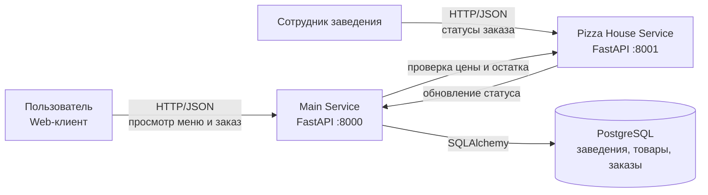
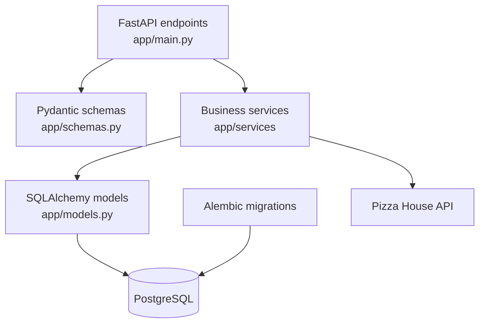
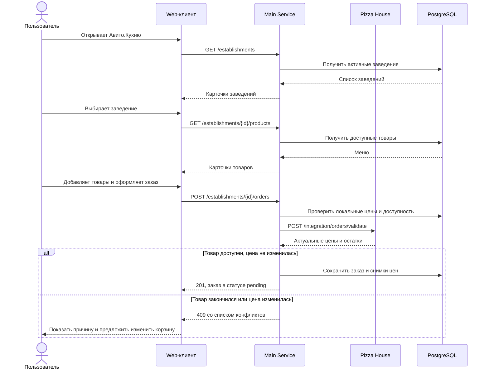
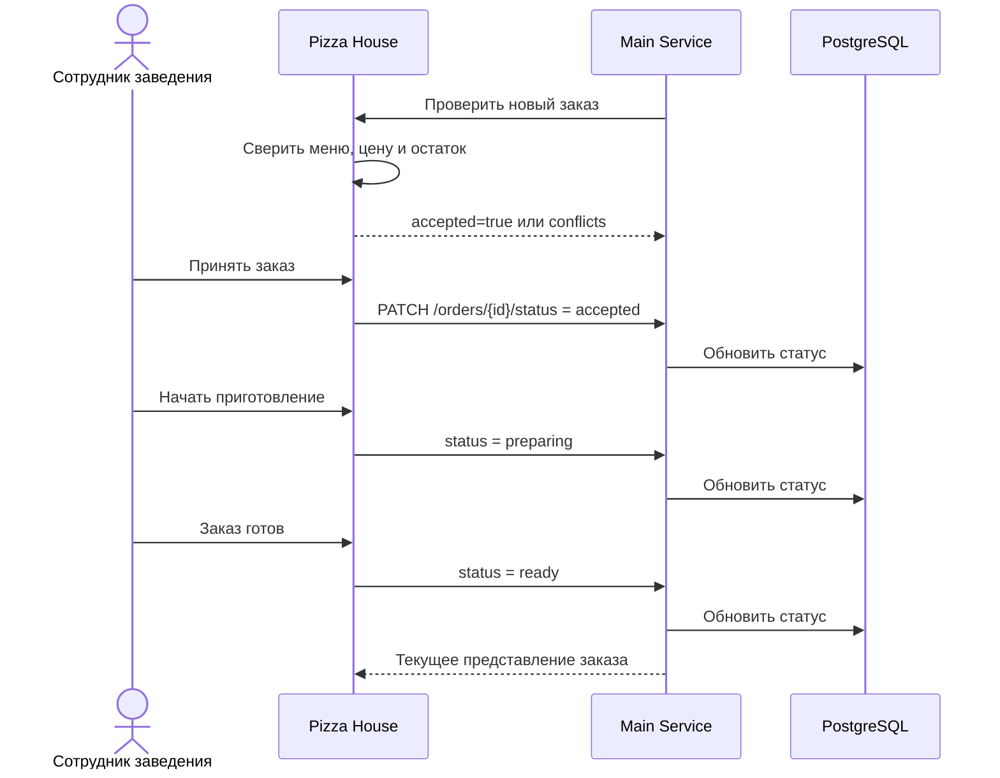
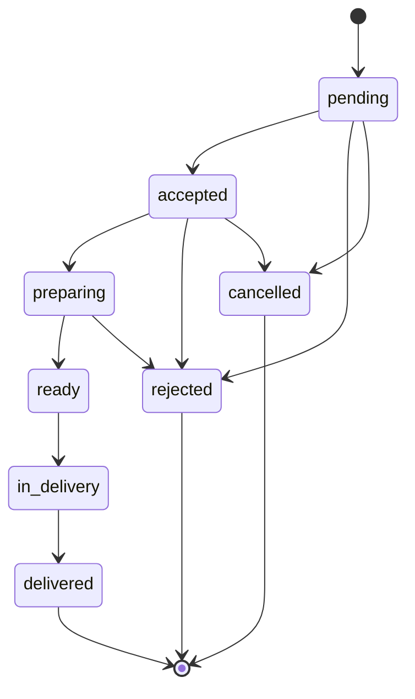
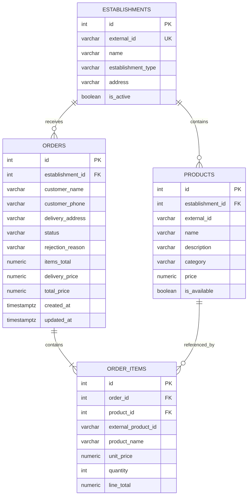

# Архитектура и пользовательские сценарии

## C4 Container diagram

Main Service является источником истины для заказов и хранит копию
каталога заведений. Pizza House Service имитирует внешнюю систему
ресторана и хранит актуальные остатки и цены демонстрационного заведения.

## Компоненты Main Service

## CJM пользователя

## CJM заведения

## Жизненный цикл заказа

`rejected` устанавливается заведением, а `cancelled` — пользователем.
Для перехода в `rejected` обязательно указывается причина.

## Схема базы данных

В `order_items` сохраняется снимок названия и цены. Поэтому уже созданный
заказ не изменится, если ресторан позднее переименует товар или обновит цену.

## Решения и ограничения MVP

- Авторизация отсутствует согласно условиям задания.
- Корзина хранится на стороне клиента; сервер повторно проверяет её при заказе.
- Денежные значения хранятся как `NUMERIC(12, 2)`/`Decimal`, а не `float`.
- Один заказ относится только к одному заведению.
- Сервис заведения хранит меню в памяти для демонстрации интеграции.
- Распределённая транзакция и резервирование остатков не реализованы.
- При недоступности сервиса заведения Main Service отвечает кодом `503`.
- При изменении цены или отсутствии товара возвращается `409` с конфликтами.